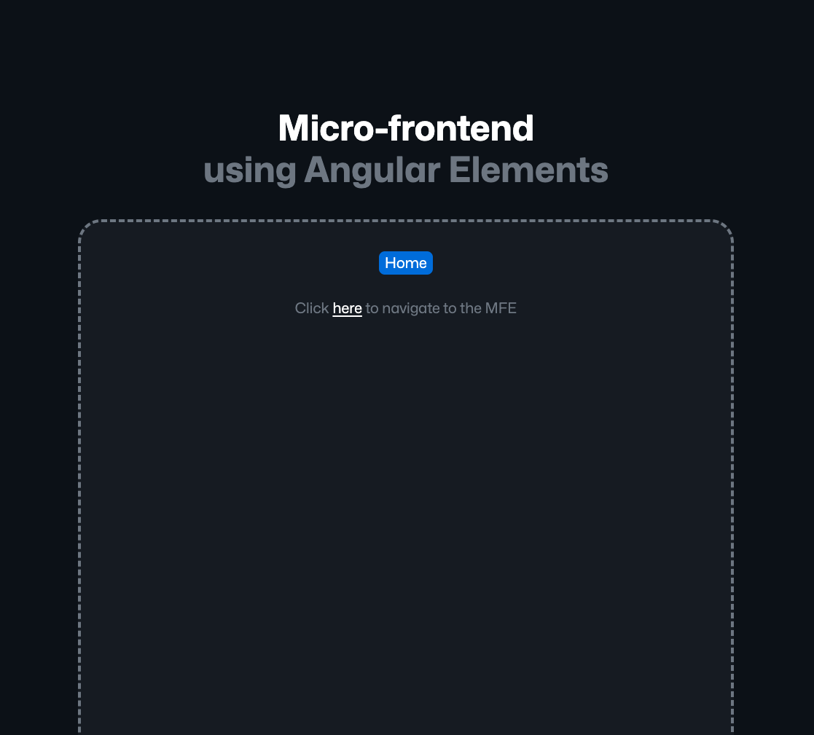

# Micro-frontend using Angular Elements

An example of a micro-frontend using **Angular Elements** and **Nx**.

## Introduction

Large applications are hard to maintain or scale and like microservices are a solution to solve this problem in backend software architecture, micro-frontends are a way to break down large applications into smaller, more manageable pieces of UI.

In this example, we use **Nx** to create a minimal monorepo containing:
- **apps/mfe**: The main Angular application that will be consumed by another Angular application at runtime (e.g. a regular application or another micro-frontend)
- **apps/playground**: A simple Angular application that acts as a shell application to develop and test the micro-frontend
- **libs/***: Some shared libraries that whould be in a dedicated library repository in a real-world use case

You can imagine for example an architecture where `n` teams are working on `n` micro-frontends (and so monorepos) where a minimal shell application consumes all the micro-frontends to create a final product.

Each team can so work independently (whatever framework version they use) and are responsible for their own CI/CD without impacting the others.

## Features

- **Nx Workspace**: Minimal monorepo to develop our micro-frontend and scaffold features quickly.
- **Angular Elements**: Web Components allows us to create fully encapsulated micro-frontends (teams can use different framework versions).
- **Shared Change Detection**: A `zone.js` instance is shared through `window` object to ensure change detection is working across micro-frontends like it would in a regular Angular application.
- **Synced Routing**: Allows using multiple Angular routers without degrading the user experience. The shell application is the only one responsible for browser location interactions so we need to sync the router state across micro-frontends.

## Preview



## Running locally

Install workspace:

```
git clone https://github.com/fonsecaj/nx-angular-mfe

cd nx-angular-mfe

npm i
```

Start both applications using:

```
npm start
```

...or directly using `nx` CLI

```
nx run-many -t serve
```

## Useful links

- [Nx Monorepo](https://nx.dev/)
- [Angular Elements](https://angular.dev/guide/elements#using-custom-elements)
- [Angular Extensions Elements](https://angular-extensions.github.io/elements/home)
